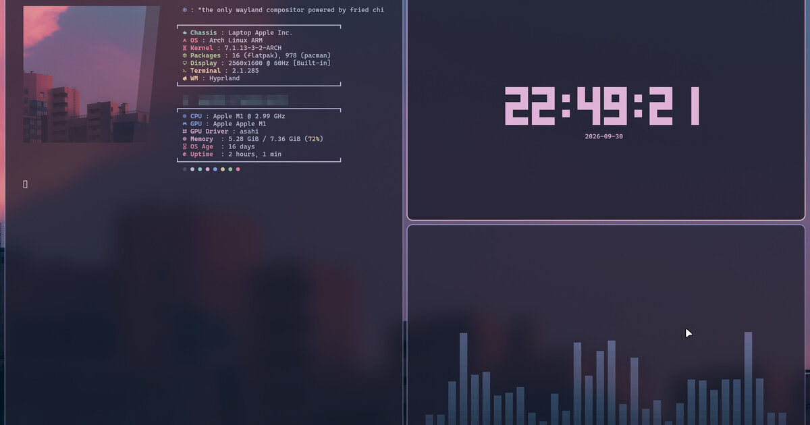

# 🌙 sonoyumi.github.io

  
  
  

**🇬🇧 [English](#en)** · **🇮🇹 [Italiano](#it)** · **🇺🇦 [Українська](#uk)** · **🇷🇺 [Русский](#ru)**

**Live:** https://sonoyumi.github.io

---

## 🇬🇧 English

My portfolio site: projects, skills, my Linux setup, CV and contacts. Hand-written HTML, CSS and JavaScript,
no frameworks and no build step. Colors follow the Rosé Pine palette, with a dark and a light theme.

All content lives in `data/projects.js` — to add a project, add one object there and a cover to `assets/covers/`.

### Author

**Vladyslav Shokun** ([@sonoyumi](https://github.com/sonoyumi)), Python developer: Telegram bots, web scraping, automation.

---

## 🇮🇹 Italiano

**[🇬🇧 English](#en)** · **🇮🇹 Italiano** · **[🇺🇦 Українська](#uk)** · **[🇷🇺 Русский](#ru)**

Il mio sito portfolio: progetti, competenze, il mio setup Linux, CV e contatti. HTML, CSS e JavaScript scritti a mano,
senza framework e senza build. Colori della palette Rosé Pine, con tema scuro e chiaro.

Tutti i contenuti stanno in `data/projects.js`: per aggiungere un progetto basta un oggetto lì e una copertina in `assets/covers/`.

---

## 🇺🇦 Українська

**[🇬🇧 English](#en)** · **[🇮🇹 Italiano](#it)** · **🇺🇦 Українська** · **[🇷🇺 Русский](#ru)**

Мій сайт-портфоліо: проєкти, навички, мій сетап на Linux, CV і контакти. HTML, CSS і JavaScript, написані вручну,
без фреймворків і без збірки. Кольори — палітра Rosé Pine, темна й світла тема.

Увесь вміст — у `data/projects.js`: щоб додати проєкт, достатньо одного об'єкта там і обкладинки в `assets/covers/`.

---

## 🇷🇺 Русский

**[🇬🇧 English](#en)** · **[🇮🇹 Italiano](#it)** · **[🇺🇦 Українська](#uk)** · **🇷🇺 Русский**

Мой сайт-портфолио: проекты, навыки, мой сетап на Linux, CV и контакты. HTML, CSS и JavaScript, написанные вручную,
без фреймворков и без сборки. Цвета — палитра Rosé Pine, тёмная и светлая тема.

Всё содержимое — в `data/projects.js`: чтобы добавить проект, достаточно одного объекта там и обложки в `assets/covers/`.
